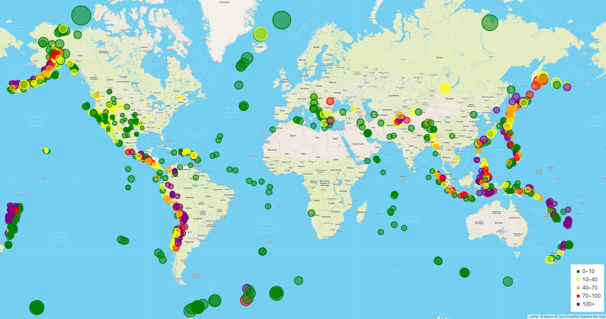

# Leaflet Homework - Visualizing Data with Leaflet

## Background

Welcome to the United States Geological Survey, or USGS for short! The USGS is responsible for providing scientific data about natural hazards, the health of our ecosystems and environment; and the impacts of climate and land-use change. Their scientists develop new methods and tools to supply timely, relevant, and useful information about the Earth and its processes. As a new hire, you will be helping them out with an exciting new project!

The USGS is interested in building a new set of tools that will allow them visualize their earthquake data. They collect a massive amount of data from all over the world each day, but they lack a meaningful way of displaying it. Their hope is that being able to visualize their data will allow them to better educate the public and other government organizations (and hopefully secure more funding..) on issues facing our planet.

For this project, I created a map using Leaflet that plots all of the earthquakes in the past seven days with a magniuted over 2.5 on their longitude and latitude. The data markers reflect the magnitude of the earthquake by their size and and depth of the earth quake by color. Earthquakes with higher magnitudes should appear larger and earthquakes with greater depth should appear darker in color.

## Requirements

In order to run this map you will need to get an API key from https://www.mapbox.com/ and add it to the config.js file.

